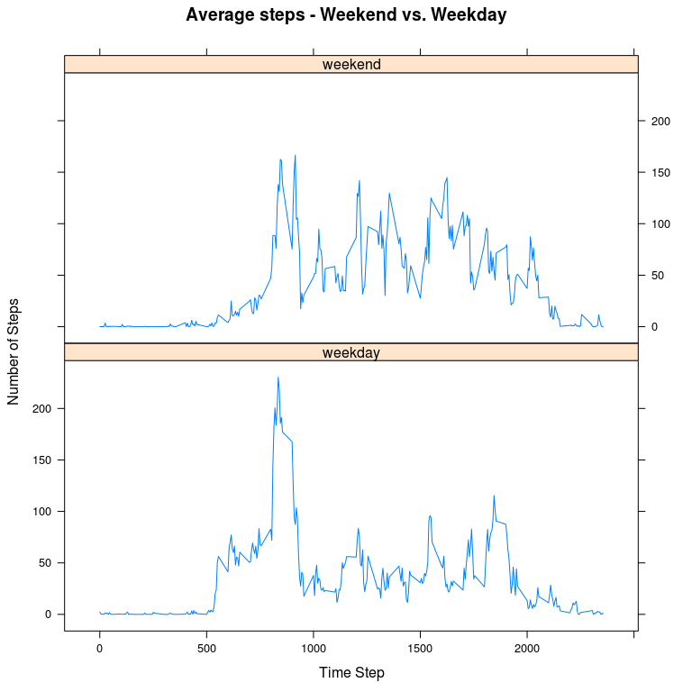

# Reproducible Research: Peer Assessment 1


## Loading and preprocessing the data


```r
library(lattice)
activity <- read.csv("activity.csv")
day_sub <- split(activity$steps, activity$date)
```

## What is mean total number of steps taken per day?

```r
steps_day = sapply(day_sub, sum)
hist(steps_day, breaks = 20, main = "Histogram - total number of steps per day", 
    xlab = "number of steps")
```

 


```r
mean_steps <- mean(steps_day, na.rm = TRUE)
median_steps <- median(steps_day, na.rm = TRUE)
```


The mean number of steps is: **10766.2**  
The median number of steps is: **10765**  

## What is the average daily activity pattern?


```r
mat <- matrix(unlist(day_sub), ncol = length(day_sub))
interval <- split(activity$interval, activity$date)[[1]]
time_avg <- data.frame(time = interval, step_avg = apply(mat, 1, mean, na.rm = TRUE))
```


```r
max_interval <- time_avg$time[which.max(time_avg$step_avg)]
```


Which 5-minute interval, on average across all the days in the dataset, contains the maximum number of steps?  
Interval number: **835**  


## Imputing missing values

```r
# 1. Find number of missing values
num_na <- sum(is.na(mat))

# 2. Fill in missing values with mean of 5-minute interval
mat_new <- mat
for (n in 1:dim(mat_new)[1]) {
    for (m in 1:dim(mat_new)[2]) {
        if (is.na(mat_new[n, m])) {
            mat_new[n, m] <- time_avg$step_avg[[n]]
        }
    }
}

# 3 create histogram
steps_day_new <- apply(mat_new, 2, sum)
hist(steps_day_new, breaks = 20, main = "Histogram - total number of steps per day (with na's filled in)", 
    xlab = "number of steps")
```

 


```r
mean_steps_new <- mean(steps_day_new)
median_steps_new <- median(steps_day_new)
```

The mean number of steps is: **10766.2**  
The median number of steps is: **10766.2**

There is no difference in the mean, since all na values were substituted with their "mean" values. However, the median moved slightly because there were values that weren't there before that have an average value.


## Are there differences in activity patterns between weekdays and weekends?

```r
days <- weekdays(as.Date(names(day_sub)))
wkend = mat_new[,(days == "Saturday" | days == "Sunday")]
wkday = mat_new[,(days != "Saturday" & days != "Sunday")]
time_avg_wd <- data.frame(time = interval, step_avg = apply(wkday, 1, mean, na.rm = TRUE), type = "weekday")
time_avg_we <- data.frame(time = interval, step_avg = apply(wkend, 1, mean, na.rm = TRUE), type = "weekend")
time_avg_1 <- rbind(time_avg_wd, time_avg_we)
xyplot(time_avg_1$step_avg ~ time_avg_1$time | as.factor(time_avg_1$type), type = "l", layout = c(1,2), xlab = "Time Step", ylab = "Number of Steps", main = "Average steps - Weekend vs. Weekday")
```

 

There seems to be a difference in the Weekend vs. Weekday activity patterns: The weekend activity appears to be more uniform, while the Weekday graph seems to have a sharp peak around 700-800. This could be due to a morning jogging/walking routine only on the weekdays.

